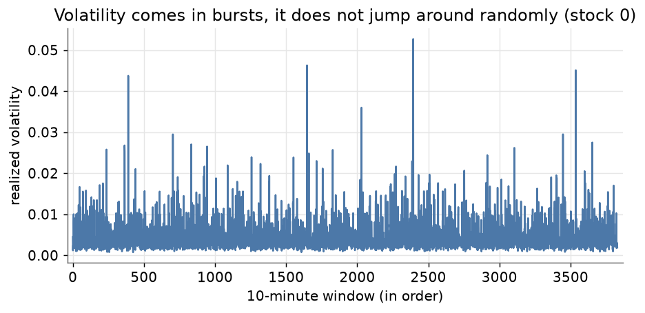
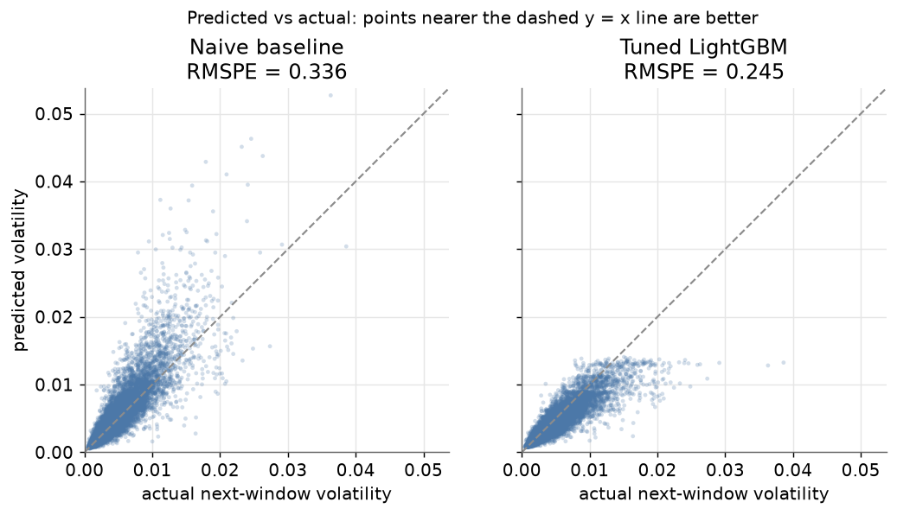
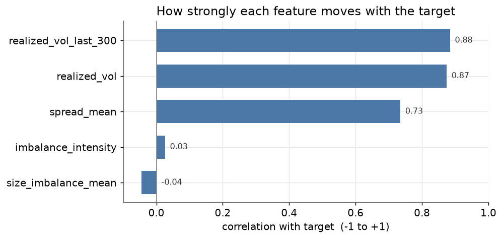

# Optiver Realized Volatility Prediction

Predicting a stock's **next-10-minute realized volatility** from its order-book
data, recreating [Optiver's Kaggle competition](https://www.kaggle.com/competitions/optiver-realized-volatility-prediction).
The interesting part is *not* that a model works — it's that a dead-simple
baseline is already hard to beat, because **volatility clusters in time**. The
real work is engineering order-book features that add signal beyond it.

> Built as a learning project.
> All numbers below are on a **4-stock subset** (`stock_id` 0–3), the development subset used throughout enough to prove the pipeline is correct and honest.

---

## The result in one line

| Model | RMSPE (lower is better) |
|---|---|
| Naive baseline (use this window's volatility as the prediction) | **0.336** |
| LightGBM, default hyperparameters | 0.250 |
| LightGBM, tuned hyperparameters | **0.245** |

The tuned model cuts the error **~27%** below the baseline. RMSPE is a
*percentage* error, so 0.336 means the baseline is off by ~34% on average and
the model by ~24%.

---

## Why the baseline is strong: volatility clusters

Volatility does not jump around randomly. Turbulent periods are followed by
turbulent periods, and calm by calm. So "assume the next 10 minutes look like
the last 10 minutes" is already a decent prediction. Beating it is the whole
challenge.



---

## Baseline vs. tuned model

Each point is one 10-minute window: the x-axis is the true next-window
volatility, the y-axis is the prediction. Points on the dashed `y = x` line are
perfect. The naive baseline scatters widely and tends to **overshoot** (points
above the line); the tuned LightGBM hugs the diagonal far more tightly.



---

## What helped, and what didn't



- **`realized_vol` (0.87)** and **`realized_vol_last_300` (0.88)** carry almost
  all of the signal — unsurprising, since the target *is* future volatility.
  They are strongly collinear with each other; the "last 300s" version is
  marginally better because it is closer in time to the window being predicted.
- **`spread_mean` (0.73)** is a genuine, independent signal: wider bid–ask
  spreads go with more volatile stocks.
- **`size_imbalance_mean` (−0.04)** and the derived **`imbalance_intensity`
  (0.03)** barely move with the target on these four stocks. `imbalance_intensity`
  was a reasoned attempt (a V-shape: imbalance in *either* direction might signal
  pressure) but it did not pay off here. 

**The two things that actually mattered were not the fancy features or the
tuning:**

1. **Matching the loss to the metric.** Training with
   `sample_weight = 1 / target²` makes the model optimize *percentage* error
   (what RMSPE measures) instead of absolute error. This alone moved the score
   from ~0.283 to ~0.250 — the single biggest jump.
2. **Honest cross-validation.** 5-fold **`GroupKFold` split by `time_id`**, so all
   rows from the same market moment stay in the same fold. Without this, near-
   identical rows leak across train/test and the score looks better than it is.

Hyperparameter tuning (`RandomizedSearchCV` over `learning_rate` and
`num_leaves`, plus early stopping to pick the tree count) only bought the last
**~2%** (0.250 -> 0.245). That ordering, features and loss first, tuning last,
is the real takeaway.

---

## How it works (the pipeline)

1. **WAP** (weighted average price) per order-book snapshot:
   `(bid_price1·ask_size1 + ask_price1·bid_size1) / (bid_size1 + ask_size1)`.
2. **Log return** between consecutive snapshots, computed *within* each window.
3. **Realized volatility** = `sqrt(sum of squared log returns)` over a window.
4. **Features** per `(stock_id, time_id)`: realized vol, last-300s realized vol,
   mean spread, mean size imbalance, imbalance intensity.
5. **Model**: LightGBM regressor, tuned, under `GroupKFold` CV with the
   `1/target²` weighting, scored with RMSPE on pooled out-of-fold predictions.

---

## Reproduce it

```bash
# 1. Environment
python -m venv .venv
source .venv/bin/activate
pip install -r requirements.txt

# 2. Data — download from Kaggle (free account + accept competition rules):
#    https://www.kaggle.com/competitions/optiver-realized-volatility-prediction
#    Extract so that data/train.csv and data/book_train.parquet/ exist.

# 3. Regenerate the figures above (uses the 4-stock subset, runs in seconds)
python make_plots.py
```

- `explore_data.ipynb` — the step-by-step exploration, from the target math
  through feature engineering, the model, and hyperparameter tuning.
- `make_plots.py` — regenerates the three figures in `plots/`.
- The `data/` folder is **not** in this repo (it is large; download separately).

---

## Scope

- Numbers are on **4 stocks**, not the full ~112-stock dataset. The point was a
  correct, well-evaluated pipeline, not a competition-grade score. Scaling to all
  stocks and adding **trade-data features** (trade count/volume) are the obvious
  next steps.
- No trades, no real money. This is a prediction exercise, not a trading system.
